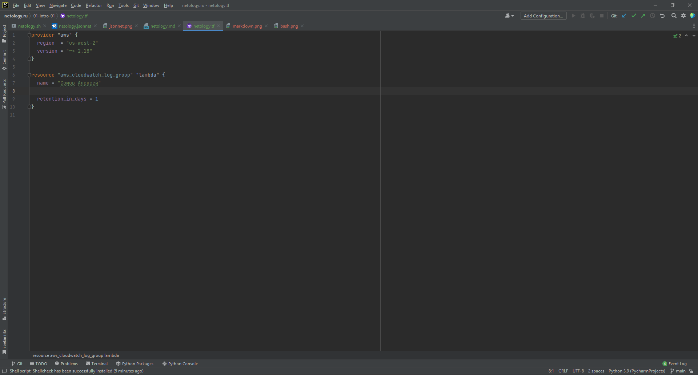
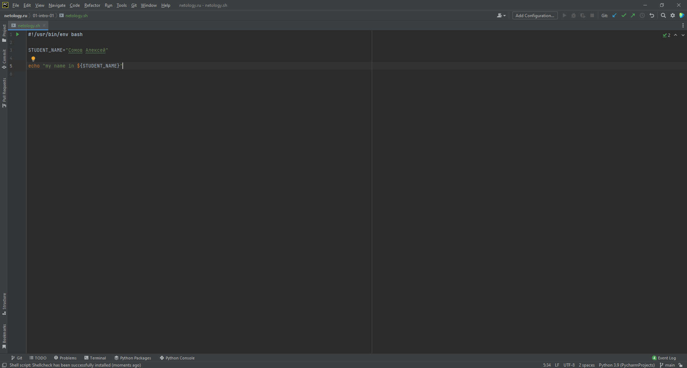
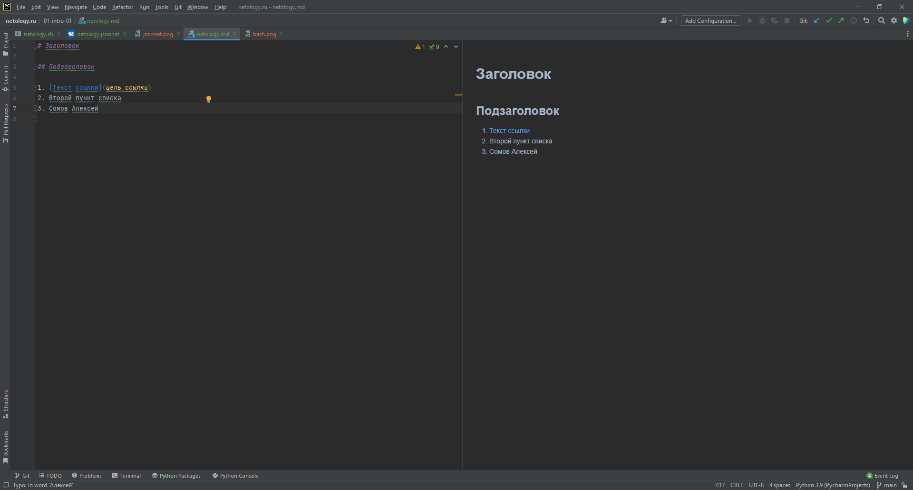
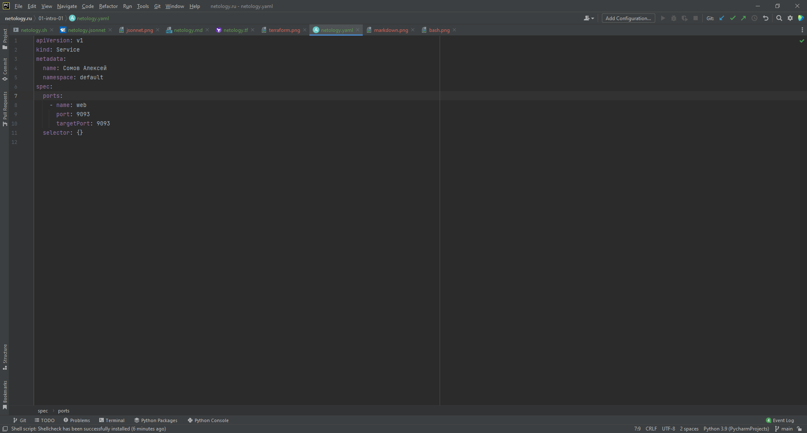
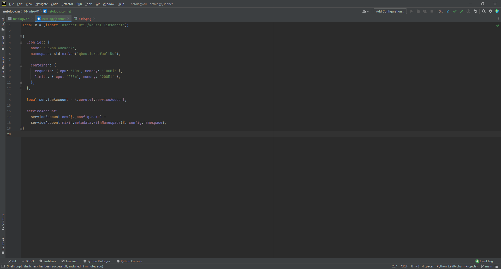

# Домашнее задание к занятию «1.1. Введение в DevOps»

## Задание №1 - Подготовка рабочей среды

### Файлы для проверки плагинов

- [netology.tf](netology.tf) – terraform,
- [netology.sh](netology.sh) – bash,
- [netology.md](netology.md) – markdown, 
- [netology.yaml](netology.yaml) – yaml,
- [netology.jsonnet](netology.jsonnet) – jsonnet.

### Снимки экрана

- Terraform: 
- Bash: 
- Markdown: 
- Yaml: 
- Jsonnet: 

## Задание №2 - Описание жизненного цикла задачи (разработки нового функционала)

[Решение](lifecycle.txt)
