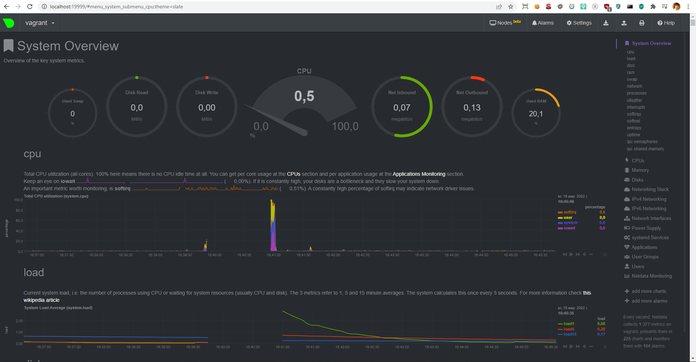

# Домашнее задание к занятию "3.4. Операционные системы, лекция 2"

1. На лекции мы познакомились с [node_exporter](https://github.com/prometheus/node_exporter/releases). В демонстрации его исполняемый файл запускался в background. Этого достаточно для демо, но не для настоящей production-системы, где процессы должны находиться под внешним управлением. Используя знания из лекции по systemd, создайте самостоятельно простой [unit-файл](https://www.freedesktop.org/software/systemd/man/systemd.service.html) для node_exporter:

    * поместите его в автозагрузку,
    * предусмотрите возможность добавления опций к запускаемому процессу через внешний файл (посмотрите, например, на `systemctl cat cron`),
    * удостоверьтесь, что с помощью systemctl процесс корректно стартует, завершается, а после перезагрузки автоматически поднимается.

Установим пакет в директорию /opt, и сделаем ссылку исполняемого файла в /usr/bin
```
cd /opt
curl -LO https://github.com/prometheus/node_exporter/releases/download/v1.3.1/node_exporter-1.3.1.linux-amd64.tar.gz
tar -xvf node_exporter-1.3.1.linux-amd64.tar.gz
rm node_exporter-1.3.1.linux-amd64.tar.gz
ln -s /opt/node_exporter-1.3.1.linux-amd64/node_exporter /usr/bin/node_exporter

ls -la /usr/bin/ | grep node_exporter
lrwxrwxrwx  1 root   root          50 Mar 14 12:17 node_exporter -> /opt/node_exporter-1.3.1.linux-amd64/node_exporter
```

Создадим файл с envs для сервиса
```
mkdir /etc/opt/node_exporter-1.3.1.linux-amd64
nano /etc/opt/node_exporter-1.3.1.linux-amd64/node_exporter
cat /etc/opt/node_exporter-1.3.1.linux-amd64/node_exporter
NODE_EXPORTER_VAR=value
```

Создадим конфигурационный файл для сервиса
```
nano /etc/systemd/system/node_exporter.service
cat /etc/systemd/system/node_exporter.service
[Unit]
Description=Node Exporter

[Service]
ExecStart=/opt/node_exporter-1.3.1.linux-amd64/node_exporter
EnvironmentFile=/etc/opt/node_exporter-1.3.1.linux-amd64/node_exporter

[Install]
WantedBy=default.target
```

Запустим сервис, и поместим его в автозагрузку
```
systemctl status node_exporter
● node_exporter.service - Node Exporter
     Loaded: loaded (/etc/systemd/system/node_exporter.service; disabled; vendor preset: enabled)
     Active: inactive (dead)

systemctl start node_exporter
==== AUTHENTICATING FOR org.freedesktop.systemd1.manage-units ===
Authentication is required to start 'node_exporter.service'.
Authenticating as: vagrant
Password:
==== AUTHENTICATION COMPLETE ===

systemctl status node_exporter
● node_exporter.service - Node Exporter
     Loaded: loaded (/etc/systemd/system/node_exporter.service; disabled; vendor preset: enabled)
     Active: active (running) since Mon 2022-03-14 12:39:50 UTC; 3s ago
   Main PID: 1423 (node_exporter)
      Tasks: 4 (limit: 1071)
     Memory: 2.3M
   ...

systemctl enable node_exporter

systemctl status node_exporter
● node_exporter.service - Node Exporter
     Loaded: loaded (/etc/systemd/system/node_exporter.service; enabled; vendor preset: enabled)
     Active: active (running) since Mon 2022-03-14 12:39:50 UTC; 7min ago
   ...
```

Убедимся, что параметры передались
```
ps aux | grep node_exporter
root        1423  0.0  1.1 715964 11488 ?        Ssl  12:39   0:00 /opt/node_exporter-1.3.1.linux-amd64/node_exporter
vagrant     1488  0.0  0.0   6432   736 pts/2    S+   12:44   0:00 grep --color=auto node_exporter

cat /proc/1423/environ
LANG=en_US.UTF-8PATH=/usr/local/sbin:/usr/local/bin:/usr/sbin:/usr/bin:/sbin:/bin:/snap/binINVOCATION_ID=8c55427a34254463b676c7019116b813JOURNAL_STREAM=9:33137NODE_EXPORTER_VAR=value
```

2. Ознакомьтесь с опциями node_exporter и выводом `/metrics` по-умолчанию. Приведите несколько опций, которые вы бы выбрали для базового мониторинга хоста по CPU, памяти, диску и сети.

Т.к. я использую виртуализацию, то я буду стучаться к http внутри неё, для этого я гляну есть ли доступ по http внутри
```
sudo lsof -i -P | grep node_expo
node_expo 1423            root    3u  IPv6  33153      0t0  TCP *:9100 (LISTEN)
```

Стучимся по порту 9100
```
curl localhost:9100/metrics
```

CPU
```
curl localhost:9100/metrics | grep node_cpu_seconds_total
node_cpu_seconds_total{cpu="0",mode="idle"} 18686.82
node_cpu_seconds_total{cpu="0",mode="iowait"} 2.75
node_cpu_seconds_total{cpu="0",mode="irq"} 0
node_cpu_seconds_total{cpu="0",mode="nice"} 0.01
node_cpu_seconds_total{cpu="0",mode="softirq"} 0.02
node_cpu_seconds_total{cpu="0",mode="steal"} 0
node_cpu_seconds_total{cpu="0",mode="system"} 5.44
node_cpu_seconds_total{cpu="0",mode="user"} 1.8
node_cpu_seconds_total{cpu="1",mode="idle"} 18674.5
node_cpu_seconds_total{cpu="1",mode="iowait"} 3.09
node_cpu_seconds_total{cpu="1",mode="irq"} 0
node_cpu_seconds_total{cpu="1",mode="nice"} 0.02
node_cpu_seconds_total{cpu="1",mode="softirq"} 1.46
node_cpu_seconds_total{cpu="1",mode="steal"} 0
node_cpu_seconds_total{cpu="1",mode="system"} 5.98
node_cpu_seconds_total{cpu="1",mode="user"} 1.58
```

Memory
```
curl localhost:9100/metrics | grep node_memory_MemAvailable_bytes 
node_memory_MemAvailable_bytes 7.17811712e+08

curl localhost:9100/metrics | grep node_memory_MemFree_bytes
node_memory_MemFree_bytes 4.12749824e+08
```

Disk
```
curl localhost:9100/metrics | grep node_disk_io_time_seconds_total
node_disk_io_time_seconds_total{device="dm-0"} 19.900000000000002
node_disk_io_time_seconds_total{device="sda"} 20.12

curl localhost:9100/metrics | grep node_disk_read_bytes_total
node_disk_read_bytes_total{device="dm-0"} 3.08999168e+08
node_disk_read_bytes_total{device="sda"} 3.19285248e+08

curl localhost:9100/metrics | grep node_disk_read_time_seconds_total
node_disk_read_time_seconds_total{device="dm-0"} 66.776
node_disk_read_time_seconds_total{device="sda"} 57.623000000000005

curl localhost:9100/metrics | grep node_disk_write_time_seconds_total
node_disk_write_time_seconds_total{device="dm-0"} 67.188
node_disk_write_time_seconds_total{device="sda"} 9.307
```

Network
```
curl localhost:9100/metrics | grep node_network_receive_errs_total
node_network_receive_errs_total{device="eth0"} 0
node_network_receive_errs_total{device="lo"} 0

curl localhost:9100/metrics | grep node_network_receive_bytes_total
node_network_receive_bytes_total{device="eth0"} 9.94943e+06
node_network_receive_bytes_total{device="lo"} 1.010441e+06

curl localhost:9100/metrics | grep node_network_transmit_bytes_total
node_network_transmit_bytes_total{device="eth0"} 535592
node_network_transmit_bytes_total{device="lo"} 1.13613e+06

curl localhost:9100/metrics | grep node_network_transmit_errs_total
node_network_transmit_errs_total{device="eth0"} 0
node_network_transmit_errs_total{device="lo"} 0

curl localhost:9100/metrics | grep promhttp_metric_handler_requests_total
promhttp_metric_handler_requests_total{code="200"} 21
promhttp_metric_handler_requests_total{code="500"} 0
promhttp_metric_handler_requests_total{code="503"} 0
```

3. Установите в свою виртуальную машину [Netdata](https://github.com/netdata/netdata). Воспользуйтесь [готовыми пакетами](https://packagecloud.io/netdata/netdata/install) для установки (`sudo apt install -y netdata`). После успешной установки:
    * в конфигурационном файле `/etc/netdata/netdata.conf` в секции [web] замените значение с localhost на `bind to = 0.0.0.0`,
    * добавьте в Vagrantfile проброс порта Netdata на свой локальный компьютер и сделайте `vagrant reload`:

    ```bash
    config.vm.network "forwarded_port", guest: 19999, host: 19999
    ```

    После успешной перезагрузки в браузере *на своем ПК* (не в виртуальной машине) вы должны суметь зайти на `localhost:19999`. Ознакомьтесь с метриками, которые по умолчанию собираются Netdata и с комментариями, которые даны к этим метрикам.

Netdata: 

4. Можно ли по выводу `dmesg` понять, осознает ли ОС, что загружена не на настоящем оборудовании, а на системе виртуализации?

Виртуальная и на железе
```
dmesg -T | grep 'Booting paravirtualized kernel on'
[Mon Mar 14 08:24:24 2022] Booting paravirtualized kernel on KVM

dmesg -T | grep 'Booting paravirtualized kernel on'
[Mon Mar 14 07:24:24 2022] Booting paravirtualized kernel on bare hardware
```

5. Как настроен sysctl `fs.nr_open` на системе по-умолчанию? Узнайте, что означает этот параметр. Какой другой существующий лимит не позволит достичь такого числа (`ulimit --help`)?

Максимальное число открытых дескрипторов для ядра, для пользователя задать больше этого числа нельзя, если не менять. 
Число задается кратное 1024, в данном случае = 1024 * 1024 = 1048576. 
```
sysctl fs.nr_open
fs.nr_open = 1048576
```

Лимит на пользователя снизу, который может быть увеличен в процессе работы
```
ulimit -Sn
1024
```

Лимит на пользователя сверху, который не может быть увеличен
```
ulimit -Hn
1048576
```

Макс.предел ОС:
```
cat /proc/sys/fs/file-max
9223372036854775807

sysctl fs.file-max
fs.file-max = 9223372036854775807
```

Два пользовательских лимита не могут превысить системный fs.nr_open

6. Запустите любой долгоживущий процесс (не `ls`, который отработает мгновенно, а, например, `sleep 1h`) в отдельном неймспейсе процессов; покажите, что ваш процесс работает под PID 1 через `nsenter`. Для простоты работайте в данном задании под root (`sudo -i`). Под обычным пользователем требуются дополнительные опции (`--map-root-user`) и т.д.

Открываем второй терминал и выполняем в нем
```
sudo -i
screen
unshare -f --pid --mount-proc /bin/sleep 1h
```

Глянем в первом терминале
```
sudo -i
ps aux | grep sleep
root        1912  0.0  0.0   5480   532 pts/5    S+   16:05   0:00 unshare -f --pid --mount-proc /bin/sleep 1h
root        1913  0.0  0.0   5476   596 pts/5    S+   16:05   0:00 /bin/sleep 1h
root        1917  0.0  0.0   6432   672 pts/2    R+   16:05   0:00 grep --color=auto sleep
```

Прыгаем в namespace из первого терминала, и смотрим
```
nsenter --target 1913 --pid --mount
ps aux | grep sleep
root           1  0.0  0.0   5476   596 pts/5    S+   16:05   0:00 /bin/sleep 1h
root          14  0.0  0.0   6432   668 pts/2    S+   16:07   0:00 grep --color=auto sleep
````

7. Найдите информацию о том, что такое `:(){ :|:& };:`. Запустите эту команду в своей виртуальной машине Vagrant с Ubuntu 20.04 (**это важно, поведение в других ОС не проверялось**). Некоторое время все будет "плохо", после чего (минуты) – ОС должна стабилизироваться. Вызов `dmesg` расскажет, какой механизм помог автоматической стабилизации. Как настроен этот механизм по-умолчанию, и как изменить число процессов, которое можно создать в сессии?

Поигрался с таким, чтобы убедиться, что догадка правильная...не во всех языках можно в наименовании функции использовать такой символ ':'
`fake(){ fake|fake& };fake`

Получается бесконечная рекурсия, функция сама себя вызывает, порождая фоновые процессы самой себя.
Создалось огромное количество файлов `.bash_history-*.tmp`. Видимо эти процессы их и порождали.

Если подумать о том, что везде есть ограничения...на количество памяти, на количество файлов в директории и т.п.
Видимо есть ограничения и на количество процессов в целом, и для пользователя.

Походу стабилизироваться помог этот механизм, походу он не дает зайти за пределы

`[37763.995474] cgroup: fork rejected by pids controller in /user.slice/user-1000.slice/session-15.scope`

Если установить ulimit -u 10 - число процессов будет ограниченно 10 для пользователя.