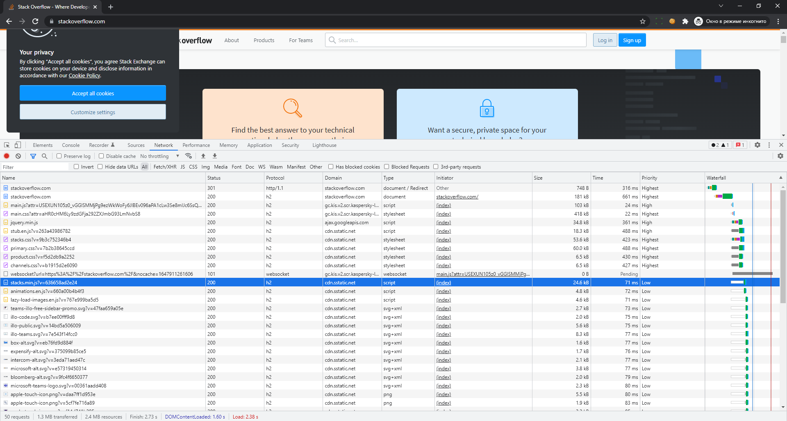

# Домашнее задание к занятию "3.6. Компьютерные сети, лекция 1"

1. Работа c HTTP через телнет.
- Подключитесь утилитой телнет к сайту stackoverflow.com
`telnet stackoverflow.com 80`
- отправьте HTTP запрос
```bash
GET /questions HTTP/1.0
HOST: stackoverflow.com
[press enter]
[press enter]
```
- В ответе укажите полученный HTTP код, что он означает?
```
Trying 151.101.193.69...
Connected to stackoverflow.com.
Escape character is '^]'.
GET /questions HTTP/1.0
HOST: stackoverflow.com

HTTP/1.1 301 Moved Permanently
feature-policy: microphone 'none'; speaker 'none'
content-security-policy: upgrade-insecure-requests; frame-ancestors 'self' https://stackexchange.com
Accept-Ranges: bytes
Fastly-Original-Body-Size: 0
Date: Tue, 22 Mar 2022 00:59:20 GMT
Via: 1.1 varnish
Connection: close
X-Served-By: cache-hhn4050-HHN
X-Cache: MISS
X-Cache-Hits: 0
X-Timer: S1647910760.424071,VS0,VE169
Vary: Fastly-SSL
X-DNS-Prefetch-Control: off
Set-Cookie: prov=3f4c9cb5-c3a2-4db9-0d9f-d10a1294304d; domain=.stackoverflow.com; expires=Fri, 01-Jan-2055 00:00:00 GMT; path=/; HttpOnly

Connection closed by foreign host.
```

301 статус нам говорит о редиректе, в данном случае речь о редиректре с http на https.

2. Повторите задание 1 в браузере, используя консоль разработчика F12.
- откройте вкладку `Network`
- отправьте запрос http://stackoverflow.com
- найдите первый ответ HTTP сервера, откройте вкладку `Headers`
- укажите в ответе полученный HTTP код.
- проверьте время загрузки страницы, какой запрос обрабатывался дольше всего?
- приложите скриншот консоли браузера в ответ.

Для чистоты эксперимента зайдем из под инкогнито.
Ответ от сервера
```
HTTP/1.1 301 Moved Permanently
cache-control: no-cache, no-store, must-revalidate
location: https://stackoverflow.com/
x-request-guid: fc04be82-da7e-4731-8cca-aef1407f3fb7
feature-policy: microphone 'none'; speaker 'none'
content-security-policy: upgrade-insecure-requests; frame-ancestors 'self' https://stackexchange.com
Transfer-Encoding: chunked
Accept-Ranges: bytes
Date: Tue, 22 Mar 2022 01:07:53 GMT
Via: 1.1 varnish
Connection: keep-alive
X-Served-By: cache-hhn4021-HHN
X-Cache: MISS
X-Cache-Hits: 0
X-Timer: S1647911274.702546,VS0,VE85
Vary: Fastly-SSL
X-DNS-Prefetch-Control: off
Set-Cookie: prov=a765da4e-894b-f83a-ead5-68d5847f4431; domain=.stackoverflow.com; expires=Fri, 01-Jan-2055 00:00:00 GMT; path=/; HttpOnly
```

Самый долгий первый запрос после редиректа на получение документа страницы (разметки).



3. Какой IP адрес у вас в интернете?

Получил через
- https://whoer.net/ru 94.180.52.7

4. Какому провайдеру принадлежит ваш IP адрес? Какой автономной системе AS? Воспользуйтесь утилитой `whois`

```
whois 94.180.52.7 | grep -E "role|origin"
role:           Network Operation Center CJSC ER-Telecom Company Novosibirsk branch
origin:         AS43478
```

5. Через какие сети проходит пакет, отправленный с вашего компьютера на адрес 8.8.8.8? Через какие AS? Воспользуйтесь утилитой `traceroute`

```
traceroute -IAn 8.8.8.8
traceroute to 8.8.8.8 (8.8.8.8), 30 hops max, 60 byte packets
 1  10.0.2.2 [*]  0.247 ms  0.226 ms  0.180 ms
 2  192.168.0.1 [*]  2.005 ms  2.370 ms  2.163 ms
 3  10.85.255.126 [*]  5.049 ms  5.255 ms  5.895 ms
 4  109.194.88.18 [AS34533/AS43478/AS41843]  4.839 ms  4.908 ms  5.098 ms
 5  * * *
 6  72.14.215.166 [AS15169]  43.821 ms  43.604 ms  43.442 ms
 7  108.170.250.129 [AS15169]  49.812 ms  49.581 ms  49.581 ms
 8  108.170.250.146 [AS15169]  61.050 ms  46.892 ms  46.072 ms
 9  * * *
10  108.170.235.204 [AS15169]  62.710 ms  62.503 ms  62.670 ms
11  172.253.79.115 [AS15169]  62.384 ms  62.179 ms  62.263 ms
12  * * *
13  * * *
14  * * *
15  * * *
16  * * *
17  * * *
18  * * *
19  * * *
20  * * *
21  8.8.8.8 [AS15169]  67.403 ms  67.191 ms  67.113 ms
```

Сеть:
- 10.X.X.X - внутренняя сеть, используется в виртуальной машине
- 109.X.X.X - AS34533/AS43478/AS41843
- 72.X.X.X - AS15169
- 108.X.X.X - AS15169
- 172.X.X.X - AS15169
- 8.X.X.X - AS15169
- '* * *' - скрытые от нас

6. Повторите задание 5 в утилите `mtr`. На каком участке наибольшая задержка - delay?

```
mtr 8.8.8.8
                                                My traceroute  [v0.93]
vagrant (10.0.2.15)                                                                            2022-03-22T02:36:41+0000 
Keys:  Help   Display mode   Restart statistics   Order of fields   quit
                                                                               Packets               Pings
 Host                                                                        Loss%   Snt   Last   Avg  Best  Wrst StDev 
 1. AS???    10.0.2.2                                                         0.0%   215    0.5   0.7   0.5   2.0   0.2 
 2. AS???    192.168.0.1                                                      0.0%   215    3.0   2.4   1.7  34.6   2.3 
 3. AS???    10.85.255.126                                                    3.3%   215    3.1   3.5   2.8  24.8   2.0 
 4. AS43478  109.194.88.18                                                    0.0%   215    2.9   3.9   2.7  44.3   3.8 
 5. AS15169  72.14.215.165                                                   88.8%   215   53.3  57.2  52.6  94.0  10.0
 6. AS15169  72.14.215.166                                                    0.0%   215   43.7  44.5  43.1  83.9   4.2 
 7. AS15169  108.170.250.129                                                  0.0%   215   50.0  50.7  49.4 104.7   4.8 
 8. AS15169  108.170.250.146                                                  0.0%   215   43.4  46.8  42.9 113.0   9.4 
 9. AS15169  209.85.249.158                                                  25.7%   215   88.2  65.4  63.7 102.7   4.9 
10. AS15169  108.170.235.204                                                  0.0%   214   62.6  63.5  62.1  98.8   4.1 
11. AS15169  172.253.79.115                                                   0.0%   214   62.6  63.1  62.2 105.5   4.4 
12. (waiting for reply)
13. (waiting for reply)
14. (waiting for reply)
15. (waiting for reply)
16. (waiting for reply)
17. (waiting for reply)
18. (waiting for reply)
19. (waiting for reply)
20. (waiting for reply)
21. AS15169  8.8.8.8                                                          0.0%   214   64.6  65.6  64.3 106.1   4.7

```

У AS15169 8.8.8.8 Avg = 65.6, среднее время задержки больше, чем у других.

7. Какие DNS сервера отвечают за доменное имя dns.google? Какие A записи? воспользуйтесь утилитой `dig`

```
dig dns.google NS +noall +answer
dns.google.             5886    IN      NS      ns3.zdns.google.
dns.google.             5886    IN      NS      ns2.zdns.google.
dns.google.             5886    IN      NS      ns1.zdns.google.
dns.google.             5886    IN      NS      ns4.zdns.google.
```

```
dig dns.google A +noall +answer
dns.google.             81      IN      A       8.8.8.8
dns.google.             81      IN      A       8.8.4.4
```

8. Проверьте PTR записи для IP адресов из задания 7. Какое доменное имя привязано к IP? воспользуйтесь утилитой `dig`
```
dig -x 8.8.8.8 +noall +answer
8.8.8.8.in-addr.arpa.   5618    IN      PTR     dns.google.
```
```
dig -x 8.8.4.4 +noall +answer
4.4.8.8.in-addr.arpa.   19958   IN      PTR     dns.google.
```

Не совсем понял то ли я сделал? Если мы знаем доменной имя, и ищем по нему ip..., то поиск по этому же ip вернет тот же результат, то доменное имя, по которому мы и искали ip.