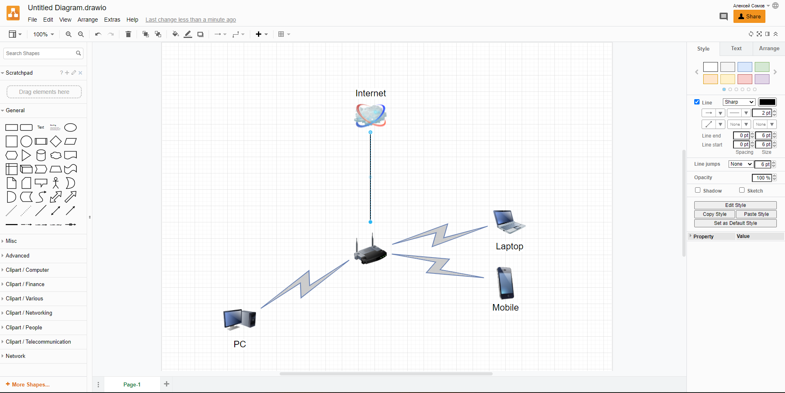

# Домашнее задание к занятию "3.8. Компьютерные сети, лекция 3"

1. Подключитесь к публичному маршрутизатору в интернет. Найдите маршрут к вашему публичному IP
```
telnet route-views.routeviews.org
Username: rviews
show ip route x.x.x.x/32
show bgp x.x.x.x/32
```
Зашел из под windows, ресурс через telnet работает
```
route-views>show ip route 94.180.110.29   
Routing entry for 94.180.108.0/22
  Known via "bgp 6447", distance 20, metric 0
  Tag 6939, type external
  Last update from 64.71.137.241 5w1d ago
  Routing Descriptor Blocks:
  * 64.71.137.241, from 64.71.137.241, 5w1d ago
      Route metric is 0, traffic share count is 1
      AS Hops 3
      Route tag 6939
      MPLS label: none
```
```
route-views>show bgp 94.180.110.29
BGP routing table entry for 94.180.108.0/22, version 311628810
Paths: (23 available, best #13, table default)
  Not advertised to any peer
  Refresh Epoch 1
  20912 3257 1299 9049 43478
    212.66.96.126 from 212.66.96.126 (212.66.96.126)
      Origin IGP, localpref 100, valid, external
      Community: 3257:8101 3257:30055 3257:50001 3257:53900 3257:53902 20912:65004
      path 7FE10399B370 RPKI State not found
      rx pathid: 0, tx pathid: 0
  Refresh Epoch 1
  3333 9002 9049 43478
    193.0.0.56 from 193.0.0.56 (193.0.0.56)
      Origin IGP, localpref 100, valid, external
      path 7FE0F80A1DC0 RPKI State not found
      rx pathid: 0, tx pathid: 0
  Refresh Epoch 1
  53767 174 174 1299 9049 43478
    162.251.163.2 from 162.251.163.2 (162.251.162.3)
      Origin IGP, localpref 100, valid, external
      Community: 174:21000 174:22013 53767:5000
 --More-- Connection closed by foreign host.
```
2. Создайте dummy0 интерфейс в Ubuntu. Добавьте несколько статических маршрутов. Проверьте таблицу маршрутизации.

```
cat /etc/iproute2/rt_tables
#
# reserved values
#
255     local
254     main
253     default
0       unspec
#
# local
#
#1      inr.ruhep
```
Глянем модуль dummy
```
modprobe dummy
modprobe -c | grep dummy
options dummy numdummies=0
```
```
sudo echo "dummy" >> /etc/modules
-bash: /etc/modules: Permission denied
```
Вспомнив лекцию о файловой системе, попробуем переключиться на root, и выполнить вновь
```
sudo -i
echo "dummy" >> /etc/modules
echo "options dummy numdummies=2" > /etc/modprobe.d/dummy.conf
```
Глянем модуль dummy, видимо тут работает переопределение, что первое нашел, то и применит
```
lsmod | grep dummy
dummy                  16384  0

modprobe -c | grep dummy
options dummy numdummies=2
options dummy numdummies=0
```
```
nano /etc/network/interfaces

auto dummy0
iface dummy0 inet static
address 10.2.2.2/32
pre-up ip link add dummy0 type dummy
post-down ip link del dummy0
```
Перезапускаем службу networking
```
sudo systemctl restart networking
```
Проверяем
```
ip --br address
lo               UNKNOWN        127.0.0.1/8 ::1/128 
eth0             UP             10.0.2.15/24 fe80::a00:27ff:feb1:285d/64
dummy0           UNKNOWN        10.2.2.2/32 fe80::c74:32ff:fe17:3033/64
```
Глянем маршруты
```
ip route
default via 10.0.2.2 dev eth0 proto dhcp src 10.0.2.15 metric 100 
10.0.2.0/24 dev eth0 proto kernel scope link src 10.0.2.15
10.0.2.2 dev eth0 proto dhcp scope link src 10.0.2.15 metric 100
```
Добавим маршрут
```
ip route add 192.168.2.0/24 dev dummy0
```
Глянем маршруты
```
ip route
default via 10.0.2.2 dev eth0 proto dhcp src 10.0.2.15 metric 100 
10.0.2.0/24 dev eth0 proto kernel scope link src 10.0.2.15
10.0.2.2 dev eth0 proto dhcp scope link src 10.0.2.15 metric 100
192.168.2.0/24 dev dummy0 scope link
```
Проверим, проходит ли пакет из сети 192.168.22.0
```
ip route get 192.168.2.30
192.168.2.30 dev dummy0 src 10.2.2.2 uid 0 
    cache
```
А теперь проверим через другую сеть
```
ip route get 192.168.3.30
192.168.3.30 via 10.0.2.2 dev eth0 src 10.0.2.15 uid 0 
    cache
```

3. Проверьте открытые TCP порты в Ubuntu, какие протоколы и приложения используют эти порты? Приведите несколько примеров.

Можно так глянуть
```
ss -ltp ; ss -lntp
State                  Recv-Q                 Send-Q                                   Local Address:Port                                     Peer Address:Port                 Process
LISTEN                 0                      4096                                     127.0.0.53%lo:domain                                        0.0.0.0:*                     users:(("systemd-resolve",pid=656,fd=13))
LISTEN                 0                      128                                            0.0.0.0:ssh                                           0.0.0.0:*                     users:(("sshd",pid=820,fd=3))
LISTEN                 0                      128                                               [::]:ssh                                              [::]:*                     users:(("sshd",pid=820,fd=4))
State                   Recv-Q                  Send-Q                                   Local Address:Port                                   Peer Address:Port                 Process
LISTEN                  0                       4096                                     127.0.0.53%lo:53                                          0.0.0.0:*                     users:(("systemd-resolve",pid=656,fd=13))
LISTEN                  0                       128                                            0.0.0.0:22                                          0.0.0.0:*                     users:(("sshd",pid=820,fd=3))
LISTEN                  0                       128                                               [::]:22                                             [::]:*                     users:(("sshd",pid=820,fd=4))
```
А приложения найти потом через which -a systemd-resolve и which -a sshd

Можно так
```
netstat -pnlt
Active Internet connections (only servers)
Proto Recv-Q Send-Q Local Address           Foreign Address         State       PID/Program name
tcp        0      0 127.0.0.53:53           0.0.0.0:*               LISTEN      656/systemd-resolve
tcp        0      0 0.0.0.0:22              0.0.0.0:*               LISTEN      820/sshd: /usr/sbin
tcp6       0      0 :::22                   :::*                    LISTEN      820/sshd: /usr/sbin
```

4. Проверьте используемые UDP сокеты в Ubuntu, какие протоколы и приложения используют эти порты?

```
ss -lup ; ss -lnup
State                  Recv-Q                 Send-Q                                   Local Address:Port                                     Peer Address:Port                 Process
UNCONN                 0                      0                                        127.0.0.53%lo:domain                                        0.0.0.0:*                     users:(("systemd-resolve",pid=656,fd=12))
UNCONN                 0                      0                                       10.0.2.15%eth0:bootpc                                        0.0.0.0:*                     users:(("systemd-network",pid=625,fd=19))
State                  Recv-Q                  Send-Q                                    Local Address:Port                                   Peer Address:Port                 Process
UNCONN                 0                       0                                         127.0.0.53%lo:53                                          0.0.0.0:*                     users:(("systemd-resolve",pid=656,fd=12))
UNCONN                 0                       0                                        10.0.2.15%eth0:68                                          0.0.0.0:*                     users:(("systemd-network",pid=625,fd=19))
```
```
netstat -pnlu
Active Internet connections (only servers)
Proto Recv-Q Send-Q Local Address           Foreign Address         State       PID/Program name
udp        0      0 127.0.0.53:53           0.0.0.0:*                           656/systemd-resolve
udp        0      0 10.0.2.15:68            0.0.0.0:*                           625/systemd-network
```

5. Используя diagrams.net, создайте L3 диаграмму вашей домашней сети или любой другой сети, с которой вы работали. 

];D 

 ---
## Задание для самостоятельной отработки (необязательно к выполнению)

6*. Установите Nginx, настройте в режиме балансировщика TCP или UDP.

7*. Установите bird2, настройте динамический протокол маршрутизации RIP.

8*. Установите Netbox, создайте несколько IP префиксов, используя curl проверьте работу API.

 ---
