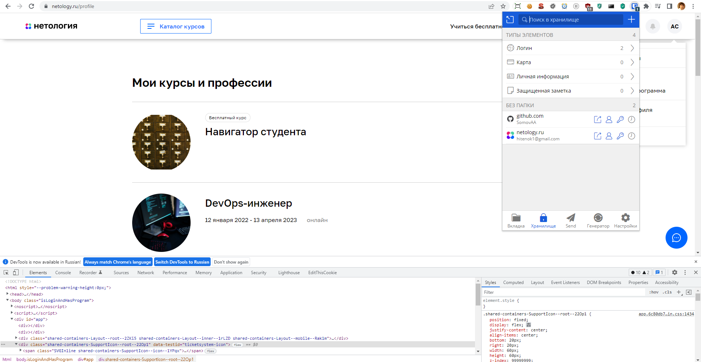
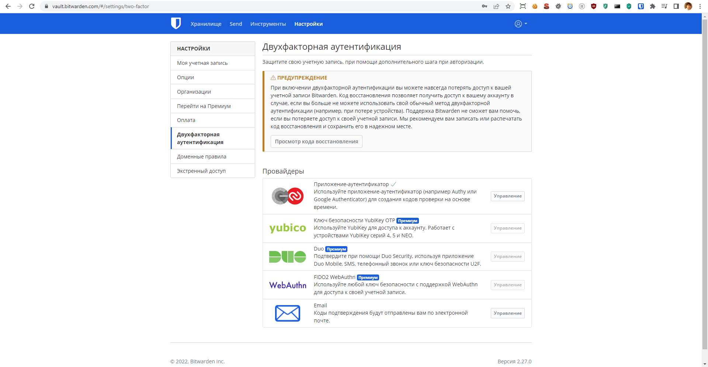
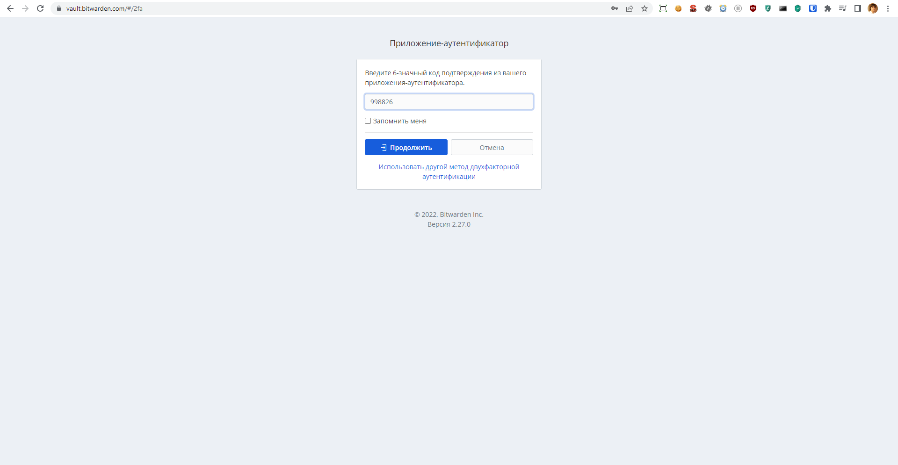
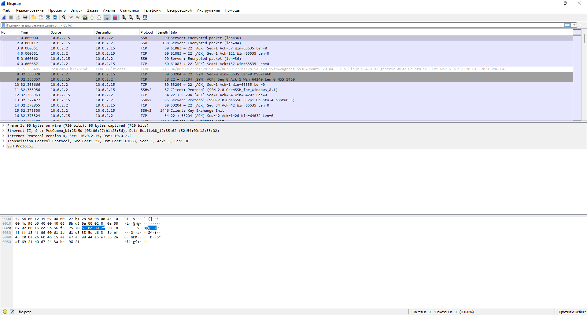

# Домашнее задание к занятию "3.9. Элементы безопасности информационных систем"

1. Установите Bitwarden плагин для браузера. Зарегистрируйтесь и сохраните несколько паролей.



2. Установите Google authenticator на мобильный телефон. Настройте вход в Bitwarden аккаунт через Google authenticator OTP.




3. Установите apache2, сгенерируйте самоподписанный сертификат, настройте тестовый сайт для работы по HTTPS.

Установим nginx вместо apache2
```
sudo apt install nginx
```
Проверим доступность по url
```
curl 127.0.0.1
<!DOCTYPE html>
<html>
<head>
...
</head>
<body>
<h1>Welcome to nginx!</h1>
...
</body>
</html>
```
Разместим html файл
```
sudo mkdir /var/www/test
sudo nano /var/www/test/index.html
cat /var/www/test/index.html
<h1>Hello SomovAA</h1>
```
Попробуем установить свою конфигурацию на порт 81
```
sudo nano /etc/nginx/conf.d/test.conf
server {
    listen       81;
    server_name  test.com;
    root         /var/www/test;
}
```
Проверим адекватность конфиг nginx
```
service nginx configtest
 * Testing nginx configuration 
```
Перегрузим конфиги без перезагрузки сервера
```
sudo service nginx reload
```
Проверим работу
```
curl 127.0.0.1:81
<h1>Hello SomovAA</h1>
```
Теперь сгенерируем сертификаты
```
sudo openssl req -x509 -nodes -days 365 -newkey rsa:2048 \-keyout /etc/ssl/private/nginx-selfsigned.key \-out /etc/ssl/certs/nginx-selfsigned.crt \-subj "/C=RU/ST=Moscow/L=Moscow/O=Company Name/OU=Org/CN=test.com"   
Generating a RSA private key
....................................................................+++++
......+++++
writing new private key to '/etc/ssl/private/nginx-selfsigned.key'
-----
```
Зайдем на сайт для генерации надежных дефолтных конфиг ssl https://ssl-config.mozilla.org/, возьмем для nginx, и подправим для себя

Сгенерируем dhparam при помощи ssl-config.mozilla.org, но можно и через openssl
```
sudo curl https://ssl-config.mozilla.org/ffdhe2048.txt > /etc/nginx/dhparam
  % Total    % Received % Xferd  Average Speed   Time    Time     Time  Current
                                 Dload  Upload   Total   Spent    Left  Speed
100   423  100   423    0     0   1251      0 --:--:-- --:--:-- --:--:--  1251
```
А теперь все необходимое у нас есть, чтобы заработало, вставим нужное в конфиги
```
sudo nano /etc/nginx/conf.d/test.conf

server {
    listen       81;
    server_name  test.com;
    
    location / {
        return 301 https://test.com$request_uri;
    }
}

server {
    listen 443 ssl http2;
    server_name  test.com;
    root         /var/www/test;

    ssl_certificate /etc/ssl/certs/nginx-selfsigned.crt;
    ssl_certificate_key /etc/ssl/private/nginx-selfsigned.key;
    ssl_session_timeout 1d;
    ssl_session_cache shared:MozSSL:10m;  # about 40000 sessions
    ssl_session_tickets off;

    # curl https://ssl-config.mozilla.org/ffdhe2048.txt > /path/to/dhparam
    ssl_dhparam /etc/nginx/dhparam;

    # intermediate configuration
    ssl_protocols TLSv1.2 TLSv1.3;
    ssl_ciphers ECDHE-ECDSA-AES128-GCM-SHA256:ECDHE-RSA-AES128-GCM-SHA256:ECDHE-ECDSA-AES256-GCM-SHA384:ECDHE-RSA-AES256-GCM-SHA384:ECDHE-ECDSA-CHACHA20-POLY1305:ECDHE-RSA-CHACHA20-POLY1305:DHE-RSA-AES128-GCM-SHA256:DHE-RSA-AES256-GCM-SHA384;
    ssl_prefer_server_ciphers off;

    # HSTS (ngx_http_headers_module is required) (63072000 seconds)
    add_header Strict-Transport-Security "max-age=63072000" always;

    # OCSP stapling
    ssl_stapling on;
    #ssl_stapling_verify on;

    # verify chain of trust of OCSP response using Root CA and Intermediate certs
    #ssl_trusted_certificate /path/to/root_CA_cert_plus_intermediates;

    # replace with the IP address of your resolver
    #resolver 127.0.0.1;
}
```
```
service nginx configtest
 * Testing nginx configuration 
sudo service nginx reload
```
Проверим работу для 81, убедимся в редиректе
```
curl -I 127.0.0.1:81
HTTP/1.1 301 Moved Permanently
Server: nginx/1.18.0 (Ubuntu)
Date: Sat, 26 Mar 2022 12:20:03 GMT
Content-Type: text/html
Content-Length: 178
Connection: keep-alive
Location: https://test.com/
```
Проверим работу для 443
```
curl https://127.0.0.1:443
curl: (60) SSL certificate problem: self signed certificate
More details here: https://curl.haxx.se/docs/sslcerts.html

curl failed to verify the legitimacy of the server and therefore could not
establish a secure connection to it. To learn more about this situation and
how to fix it, please visit the web page mentioned above.
```
Понимаем, что самоподписанный сертификат не работает должным образом, т.к. его нет в сервисе сертификатов, 
поэтому дернем curl без проверки подлинности сертификата
```
curl -k https://127.0.0.1:443
<h1>Hello SomovAA</h1>
```

4. Проверьте на TLS уязвимости произвольный сайт в интернете (кроме сайтов МВД, ФСБ, МинОбр, НацБанк, РосКосмос, РосАтом, РосНАНО и любых госкомпаний, объектов КИИ, ВПК ... и тому подобное).

```
git clone --depth 1 https://github.com/drwetter/testssl.sh.git
cd testssl.sh
```
Когда-то я на них работал xD
```
./testssl.sh -U --sneaky https://amo.ru/

 Testing vulnerabilities 

 ROBOT                                     not vulnerable (OK)
 Secure Renegotiation (RFC 5746)           supported (OK)
 Secure Client-Initiated Renegotiation     not vulnerable (OK)
 CRIME, TLS (CVE-2012-4929)                not vulnerable (OK)
 BREACH (CVE-2013-3587)                    potentially NOT ok, "br gzip" HTTP compression detected. - only supplied "/" tested
                                           Can be ignored for static pages or if no secrets in the page
 POODLE, SSL (CVE-2014-3566)               not vulnerable (OK)
 TLS_FALLBACK_SCSV (RFC 7507)              Downgrade attack prevention supported (OK)
 SWEET32 (CVE-2016-2183, CVE-2016-6329)    not vulnerable (OK)
 FREAK (CVE-2015-0204)                     not vulnerable (OK)
 DROWN (CVE-2016-0800, CVE-2016-0703)      not vulnerable on this host and port (OK)
                                           make sure you don't use this certificate elsewhere with SSLv2 enabled services
                                           https://censys.io/ipv4?q=64E370121F38D574F28953C8054DD9EA023CFDA3E8762962182CBC76D95FA7A9 could help you to find out
 LOGJAM (CVE-2015-4000), experimental      not vulnerable (OK): no DH EXPORT ciphers, no common prime detected
 BEAST (CVE-2011-3389)                     TLS1: ECDHE-RSA-AES128-SHA ECDHE-RSA-AES256-SHA DHE-RSA-AES128-SHA DHE-RSA-AES256-SHA AES128-SHA AES256-SHA 
                                           VULNERABLE -- but also supports higher protocols  TLSv1.1 TLSv1.2 (likely mitigated)
 LUCKY13 (CVE-2013-0169), experimental     potentially VULNERABLE, uses cipher block chaining (CBC) ciphers with TLS. Check patches
 Winshock (CVE-2014-6321), experimental    not vulnerable (OK) - ARIA, CHACHA or CCM ciphers found
 RC4 (CVE-2013-2566, CVE-2015-2808)        no RC4 ciphers detected (OK)

```
А вот наша конфига, основанная на ssl-config.mozilla.org, результаты лучше :)
```
./testssl.sh -U --sneaky https://127.0.0.1:443/
 Testing vulnerabilities 

 Heartbleed (CVE-2014-0160)                not vulnerable (OK), no heartbeat extension
 CCS (CVE-2014-0224)                       not vulnerable (OK)
 Ticketbleed (CVE-2016-9244), experiment.  not vulnerable (OK), no session ticket extension
 ROBOT                                     Server does not support any cipher suites that use RSA key transport
 Secure Renegotiation (RFC 5746)           supported (OK)
 Secure Client-Initiated Renegotiation     not vulnerable (OK)
 CRIME, TLS (CVE-2012-4929)                not vulnerable (OK)
 BREACH (CVE-2013-3587)                    potentially NOT ok, "gzip" HTTP compression detected. - only supplied "/" tested
                                           Can be ignored for static pages or if no secrets in the page
 POODLE, SSL (CVE-2014-3566)               not vulnerable (OK)
 TLS_FALLBACK_SCSV (RFC 7507)              No fallback possible (OK), no protocol below TLS 1.2 offered
 SWEET32 (CVE-2016-2183, CVE-2016-6329)    not vulnerable (OK)
 FREAK (CVE-2015-0204)                     not vulnerable (OK)
 DROWN (CVE-2016-0800, CVE-2016-0703)      not vulnerable on this host and port (OK)
                                           no RSA certificate, thus certificate can't be used with SSLv2 elsewhere
 LOGJAM (CVE-2015-4000), experimental      common prime with 2048 bits detected: RFC7919/ffdhe2048 (2048 bits),
                                           but no DH EXPORT ciphers
 BEAST (CVE-2011-3389)                     not vulnerable (OK), no SSL3 or TLS1
 LUCKY13 (CVE-2013-0169), experimental     not vulnerable (OK)
 Winshock (CVE-2014-6321), experimental    not vulnerable (OK)
 RC4 (CVE-2013-2566, CVE-2015-2808)        no RC4 ciphers detected (OK)
```

5. Установите на Ubuntu ssh сервер, сгенерируйте новый приватный ключ. Скопируйте свой публичный ключ на другой сервер. Подключитесь к серверу по SSH-ключу.

Чтобы проверить работу между двумя серверами, нужно два сервера, а их нет...через vagrant поднимать и работать друг с другом не стал, т.к. думаю есть нюансы под капотом, 
поэтому решил воспользоваться внешними сервисами, даже для отправки push в git можно воспользоваться публичным ключом, поэтому рассмотрим работу с ним.

Сгенерируем ключи в файлы по умолчанию
```
ssh-keygen -C "hitenok1@gmail.com"
Generating public/private rsa key pair.
Enter file in which to save the key (/home/vagrant/.ssh/id_rsa): 
/home/vagrant/.ssh/id_rsa already exists.
Overwrite (y/n)? y
Enter passphrase (empty for no passphrase): 
Enter same passphrase again:
Your identification has been saved in /home/vagrant/.ssh/id_rsa
Your public key has been saved in /home/vagrant/.ssh/id_rsa.pub
The key fingerprint is:
SHA256:... hitenok1@gmail.com
The key's randomart image is:
+---[RSA 3072]----+
|    .o.+= . o    |
|    .... o + =   |
|        .   + +  |
|       .   + = .E|
|        S = X . o|
|         o * =++o|
|          = =.B* |
|         . =.=+o |
|          ..=+++ |
+----[SHA256]-----+
```
Скопируем публичный ключ
```
cat ~/.ssh/id_rsa.pub
ssh-rsa ... hitenok1@gmail.com
```
Зайдем в настройки ssh на github, создадим там новый ssh, вставив то, что скопировали, т.е. публичный ключ

Далее попробуем через ssh установить соединение с github
```
ssh git@github.com
PTY allocation request failed on channel 0
Hi SomovAA! You've successfully authenticated, but GitHub does not provide shell access.
Connection to github.com closed.
```

6. Переименуйте файлы ключей из задания 5. Настройте файл конфигурации SSH клиента, так чтобы вход на удаленный сервер осуществлялся по имени сервера.

Переименовываю файлы по умолчанию с придуманным именем
```
mv ~/.ssh/id_rsa ~/.ssh/git_id_rsa
```
Создадим файл config
```
touch ~/.ssh/config && chmod 600 ~/.ssh/config
nano ./.ssh/config
cat ./.ssh/config
Host githab
  HostName github.com
  IdentityFile ~/.ssh/git_id_rsa
  User git
```
Проверим
```
ssh github
PTY allocation request failed on channel 0
Hi SomovAA! You've successfully authenticated, but GitHub does not provide shell access.
Connection to github.com closed.
```

7. Соберите дамп трафика утилитой tcpdump в формате pcap, 100 пакетов. Откройте файл pcap в Wireshark.

Глянем какие сетевые интерфейсы у нас есть
```
ip --br link
lo               UNKNOWN        00:00:00:00:00:00 <LOOPBACK,UP,LOWER_UP> 
eth0             UP             08:00:27:b1:28:5d <BROADCAST,MULTICAST,UP,LOWER_UP>
dummy0           UNKNOWN        62:85:85:c8:ce:a5 <BROADCAST,NOARP,UP,LOWER_UP>
```
Соберем с eth0
```
sudo tcpdump -i eth0 -c 100 -w file.pcap
tcpdump: listening on eth0, link-type EN10MB (Ethernet), capture size 262144 bytes
100 packets captured
117 packets received by filter
0 packets dropped by kernel
```
Установим wireshark
```
sudo apt install wiresharkва -р
```
Т.к. через консоль linux в VM он не стал работать, тогда я решил из VM выкачать его в windows и открыть там
```
vagrant port
The forwarded ports for the machine are listed below. Please note that
these values may differ from values configured in the Vagrantfile if the
provider supports automatic port collision detection and resolution.

    22 (guest) => 2222 (host)
 19999 (guest) => 19999 (host)
```
Далее копируем файл в текущую директорию windows из VM
```
scp -P 2222 vagrant@127.0.0.1:/home/vagrant/file.pcap .
```
Смотрим
```
ls

Mode                 LastWriteTime         Length Name
----                 -------------         ------ ----
-a----        26.03.2022     21:33          14343 file.pcap
```
Далее открываем его через wireshark в windows


 ---
## Задание для самостоятельной отработки (необязательно к выполнению)

8*. Просканируйте хост scanme.nmap.org. Какие сервисы запущены?

9*. Установите и настройте фаервол ufw на web-сервер из задания 3. Откройте доступ снаружи только к портам 22,80,443