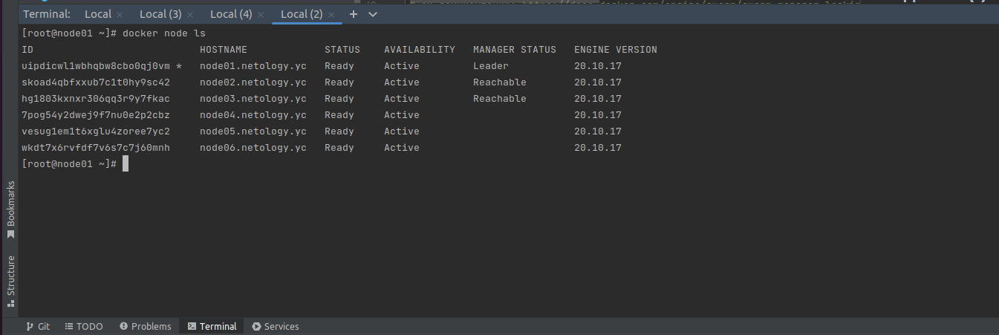
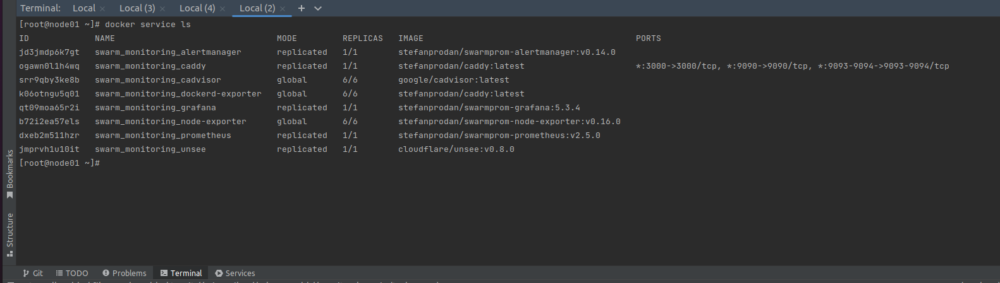

# Домашнее задание к занятию "5.5. Оркестрация кластером Docker контейнеров на примере Docker Swarm"

## Задача 1

Дайте письменые ответы на следующие вопросы:

- В чём отличие режимов работы сервисов в Docker Swarm кластере: replication и global?

replication - поднимаем столько контейнеров в кластере, сколько указали. Поднятие может быть сбалансированным, например нужно поднять 3 контейнера на образе nginx, а у 
нас 4 node, на трех поднимем, остальные не тронем. Т.е. поднимаем не на всех указанное количество, а это количество распределяется между всеми по указанным правилам.

global - для всех node кластера поднимаем столько контейнеров, сколько указали. Например для сбора статистики о железе/сети и т.п.
- Какой алгоритм выбора лидера используется в Docker Swarm кластере?

Raft, выбор осуществляется из управляющих node, каждая из которых может стать лидером, если что-то случилось с текущим.
- Что такое Overlay Network?

Когда мы создаем рой, или подключаем хост, к существующему рою, то по умолчанию на нем создаются две сети: overlay и bridge.

overlay - обрабатывает трафик управления и данных, связанный со службами роя.

Это распределенная сеть между нодами, контейнеры в ней могут безопасно обмениваться данными, 
если включен режим шифрования.

## Задача 2

Создать ваш первый Docker Swarm кластер в Яндекс.Облаке

Для получения зачета, вам необходимо предоставить скриншот из терминала (консоли), с выводом команды:
```
docker node ls
```
- Nodes: 

## Задача 3

Создать ваш первый, готовый к боевой эксплуатации кластер мониторинга, состоящий из стека микросервисов.

Для получения зачета, вам необходимо предоставить скриншот из терминала (консоли), с выводом команды:
```
docker service ls
```
- Services: 

## Задача 4 (*)

Выполнить на лидере Docker Swarm кластера команду (указанную ниже) и дать письменное описание её функционала, что она делает и зачем она нужна:
```
# см.документацию: https://docs.docker.com/engine/swarm/swarm_manager_locking/
docker swarm update --autolock=true
```

Я понял это следующим образом, есть сертификаты для общения между нодами, и ключи шифрования для raft, и docker эти данные 
защищает, пока в покое находится. Например если мы его будем перезапускать, то защиты не будет. 
Чтобы она была, мы можем включить автоблокировку.

Вот что в оф. доках написано:
- Взаимный ключ TLS и ключ шифрования, используемые для чтения и записи журналов Raft, хранятся на диске в незашифрованном виде. Существует компромисс между риском хранения незашифрованного ключа шифрования в состоянии покоя и удобством перезапуска роя без необходимости разблокировать каждого менеджера.

Попробуем перезапустить docker, и посмотреть как работает блокировка
```
[root@node01 ~]# service docker restart
Redirecting to /bin/systemctl restart docker.service

[root@node01 ~]# docker service ls
Error response from daemon: Swarm is encrypted and needs to be unlocked before it can be used. Please use "docker swarm unlock" to unlock it.
```

Убедились, что docker нам не дает использовать его функционал.

А теперь попробуем блокировку снять ключем, который нам был дан при включении блокировки

```
[root@node01 ~]# docker swarm unlock
Please enter unlock key: 

[root@node01 ~]# docker service ls
ID             NAME                                MODE         REPLICAS   IMAGE                                          PORTS
jd3jmdp6k7gt   swarm_monitoring_alertmanager       replicated   1/1        stefanprodan/swarmprom-alertmanager:v0.14.0    
ogawn0l1h4wq   swarm_monitoring_caddy              replicated   1/1        stefanprodan/caddy:latest                      *:3000->3000/tcp, *:9090->9090/tcp, *:9093-9094->9093-9094/tcp
srr9qby3ke8b   swarm_monitoring_cadvisor           global       6/6        google/cadvisor:latest                         
k06otngu5q01   swarm_monitoring_dockerd-exporter   global       6/6        stefanprodan/caddy:latest                      
qt09moa65r2i   swarm_monitoring_grafana            replicated   1/1        stefanprodan/swarmprom-grafana:5.3.4           
b72i2ea57els   swarm_monitoring_node-exporter      global       6/6        stefanprodan/swarmprom-node-exporter:v0.16.0   
dxeb2m511hzr   swarm_monitoring_prometheus         replicated   1/1        stefanprodan/swarmprom-prometheus:v2.5.0       
jmprvh1u10it   swarm_monitoring_unsee              replicated   1/1        cloudflare/unsee:v0.8.0            
```

Появление этой функции было связано с секретами в докере. 

Можно секреты (пароли, сертификаты и т.п.) хранить прям в проекте, используя ansible-vault, зашифровывая их, а ключ 
для расшифровки хранить в том месте, где будет доступ у devops и отвечающего за проект.
