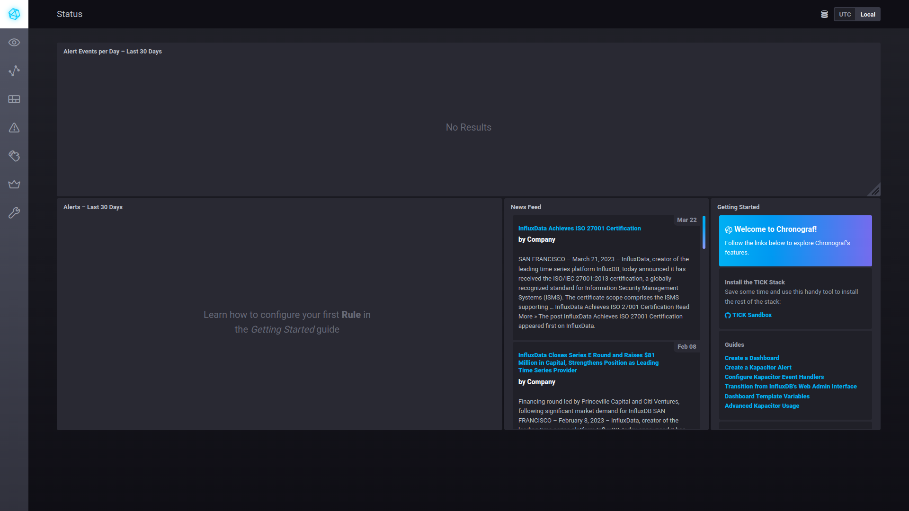
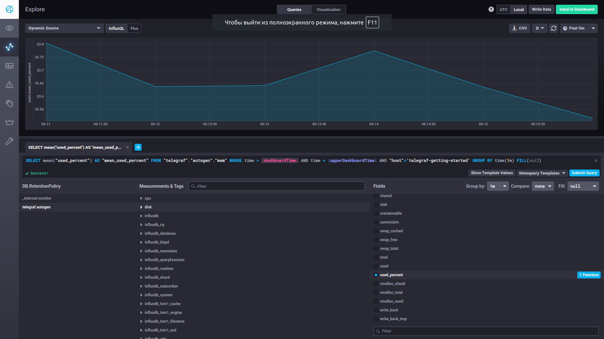
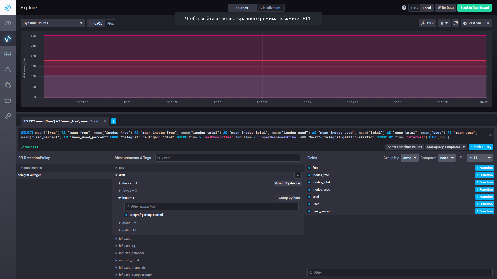
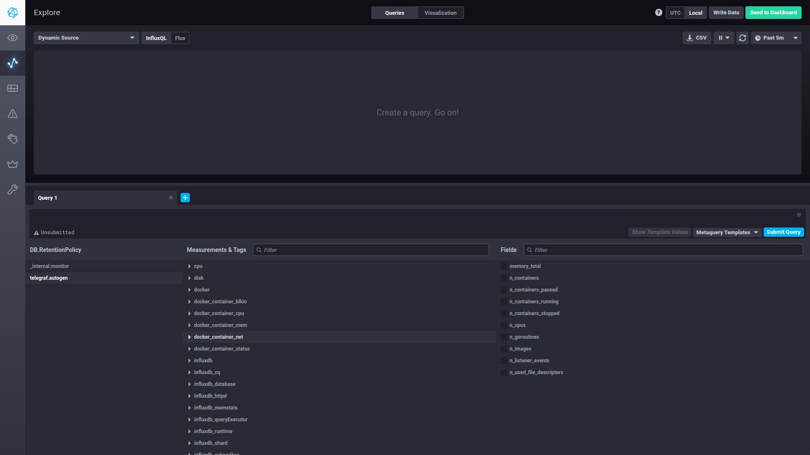

# Домашнее задание к занятию "13.Системы мониторинга"

## Обязательные задания

1. Вас пригласили настроить мониторинг на проект. На онбординге вам рассказали, что проект представляет из себя 
платформу для вычислений с выдачей текстовых отчетов, которые сохраняются на диск. Взаимодействие с платформой 
осуществляется по протоколу http. Также вам отметили, что вычисления загружают ЦПУ. Какой минимальный набор метрик вы
выведите в мониторинг и почему?

```
Если нас интересует только проблема загрузки ЦПУ и http, то все метрики по ЦПУ, и метрики, связанные с http, например общее количетсво запросов http, 
количество успешных и неуспешных запросов.
Таким образом я бы смог понять много ли ЦПУ тратится на генерацию, если да, то к разработчикам узнавать, что же они там наделали, мб 
рефакторинг сделают. Если в этом плане всё хорошо, значит из-за количества пользователей нужно увеличить ЦПУ хотя бы вертикально.

Если мы хотим решить проблемы не только с ЦПУ, которые могут возникнуть в будущем, я бы ещё добавил метрики работы с диском на чтение запись, 
на количество оставшегося места, на количество inode, проверял бы ещё справляется ли сеть с трафиком по выдаче пользователям документов. 
Таким образом из-за генерации документов может быстро место закончиться, тогда нужно увеличить объём.
Если жесткий диск слишкмо медленно работает с записью и чтением, тогда можно перейти на ssd, либо понять, что он начал ломаться и заменить на другой.
Также может закончиться место на максимальное количество файлов, тогда нужно масштабировать горизонтально, добавить ещё машин.
Если сеть не справляется, тогда можно трафик пускать по двум сетям, один для генерации, другой для выдачи документов пользователям, либо расширить сеть.
Оперативная память тоже участвует, можно и её анализировать.

В данном случае мы затронули оценки:
- работоспособности ПО
- работоспособности оборудования
```

2. Менеджер продукта посмотрев на ваши метрики сказал, что ему непонятно что такое RAM/inodes/CPUla. Также он сказал, 
что хочет понимать, насколько мы выполняем свои обязанности перед клиентами и какое качество обслуживания. Что вы 
можете ему предложить?

```
Чтобы бизнесу объяснить доступным языком, воспользуемся оценкой бизнес-мониторинга: SLO SLA SLI.

SLA: Если клиент не дождался генерации файла или его получения, значит бизнес потерял клиента, и понес убытки.
Гарантируем, что документы будут генерироваться не дольше, чем 5 сек, а отдаваться не дольше 2 секунд.

SLO: Гарантируем, что 98% пользователей сгенерируют, и получат успешно документы в нужный срок.
Остальные 2% техническое обслуживание.

SLI: 
Рассчитаем для генерации документов.
Успех: Запрос должен отдавать 200 или 300, и выполняться не более 5 секунд.
Провал: Запрос должен отдавать 400 или 500, либо отдавать 200 или 300, но отрабатывать более 5 секунд.
SLI = (summ_2xx_requests_less_than_5_sec + summ_3xx_requests_less_than_5_sec) / (summ_all_requests)

Рассчитаем для отдачи документов.
Успех: Запрос должен отдавать 200 или 300, и выполняться не более 2 секунд.
Провал: Запрос должен отдавать 400 или 500, либо отдавать 200 или 300, но отрабатывать более 2 секунд.
SLI = (summ_2xx_requests_less_than_2_sec + summ_3xx_requests_less_than_2_sec) / (summ_all_requests)
```

3. Вашей DevOps команде в этом году не выделили финансирование на построение системы сбора логов. Разработчики в свою 
очередь хотят видеть все ошибки, которые выдают их приложения. Какое решение вы можете предпринять в этой ситуации, 
чтобы разработчики получали ошибки приложения?

```
Можно восмпользоваться Black-box monitoring, а конкретно система «Перехватчик ошибок»: Sentry.
Я думаю это проще настроить, чем ELK и подобные штуки, т.к. для этого должно быть определенным образом приложение сделано, 
+ определенным образом связка между ним и ELK, и в самом ELK настройка.
А если нет денег на это, тогда ловим ошибки, и сразу куда-то им скидываем...мб на почту - бесплатно)
```

4. Вы, как опытный SRE, сделали мониторинг, куда вывели отображения выполнения SLA=99% по http кодам ответов. 
Вычисляете этот параметр по следующей формуле: summ_2xx_requests/summ_all_requests. Данный параметр не поднимается выше 
70%, но при этом в вашей системе нет кодов ответа 5xx и 4xx. Где у вас ошибка?

```
В это задании ошибка...опытный SRE сделал бы SLI=99%, а не SLA :)
И формулу бы поставил (summ_2xx_requests + summ_3xx_requests)/summ_all_requests, т.к. сервер ещё 300 отдает, но на самом деле и 1xx бывают.
```

5. Опишите основные плюсы и минусы pull и push систем мониторинга.
```
В реальном мире это можно проследить через отношения. Когда первый всегда имеет доступ к второму, а второй к первому нет, и наоборот. 
Бывают ещё и третьи лица, через которых происходит взаимодействие.

push+:
- Агент может отправлять данные как на основной сервер, так и на его реплику
- Можем отсылать разношерстные данные с каждого агента, а не одинаковые
- можем пользоваться легки протоколом без проверки данных

pull+:
- Валидация данных в одном месте, т.к. для всех агентов они одинаковые, следовательно легче контролировать.
- Настройка от сервера, он знает об агентах...даже если хакеры попытаются создать агента, сервер до него не будет доходить.
- Можно спрятать за прокси, т.к. точка вызовов одна

В данном случае минусы - это обратные плюсы.
```
6. Какие из ниже перечисленных систем относятся к push модели, а какие к pull? А может есть гибридные?

    - Prometheus ```pull```
    - TICK ```push```
    - Zabbix ```pull + push, активные и пассивные проверки```
    - VictoriaMetrics ```pull + push https://docs.victoriametrics.com/FAQ.html#what-is-the-difference-between-vmagent-and-prometheus```
    - Nagios ```push```

7. Склонируйте себе [репозиторий](https://github.com/influxdata/sandbox/tree/master) и запустите TICK-стэк, 
используя технологии docker и docker-compose.

В виде решения на это упражнение приведите выводы команд с вашего компьютера (виртуальной машины):

    - curl http://localhost:8086/ping
    - curl http://localhost:8888
    - curl http://localhost:9092/kapacitor/v1/ping

А также скриншот веб-интерфейса ПО chronograf (`http://localhost:8888`). 

P.S.: если при запуске некоторые контейнеры будут падать с ошибкой - проставьте им режим `Z`, например
`./data:/var/lib:Z`

Решение
```
$ curl -i http://localhost:8086/ping
HTTP/1.1 204 No Content
Content-Type: application/json
Request-Id: 3f6322ab-d48b-11ed-816f-0242ac150003
X-Influxdb-Build: OSS
X-Influxdb-Version: 1.8.10
X-Request-Id: 3f6322ab-d48b-11ed-816f-0242ac150003
Date: Thu, 06 Apr 2023 14:56:44 GMT

$ curl http://localhost:8888
<!DOCTYPE html><html><head><link rel="stylesheet" href="/index.c708214f.css"><meta http-equiv="Content-type" content="text/html; charset=utf-8"><title>Chronograf</title><link rel="icon shortcut" href="/favicon.70d63073.ico"></head><body> <div id="react-root" data-basepath=""></div> <script type="module" src="/index.c5ba09e6.js"></script><script src="/index.59cbcbd2.js" nomodule="" defer></script> </body></html>

curl -i http://localhost:9092/kapacitor/v1/ping
HTTP/1.1 204 No Content
Content-Type: application/json; charset=utf-8
Request-Id: 726febed-d48b-11ed-8179-0242ac150004
X-Kapacitor-Version: 1.6.5
Date: Thu, 06 Apr 2023 14:58:10 GMT
```
- 

8. Перейдите в веб-интерфейс Chronograf (`http://localhost:8888`) и откройте вкладку `Data explorer`.

    - Нажмите на кнопку `Add a query`
    - Изучите вывод интерфейса и выберите БД `telegraf.autogen`
    - В `measurments` выберите mem->host->telegraf_container_id , а в `fields` выберите used_percent. 
    Внизу появится график утилизации оперативной памяти в контейнере telegraf.
    - Вверху вы можете увидеть запрос, аналогичный SQL-синтаксису. 
    Поэкспериментируйте с запросом, попробуйте изменить группировку и интервал наблюдений.

- 

Для выполнения задания приведите скриншот с отображением метрик утилизации места на диске 
(disk->host->telegraf_container_id) из веб-интерфейса.

- 

Чтобы это заработало должным образом нужно добавить в конфигурацию телеграфа следующие плагины
```
[[inputs.mem]]
[[inputs.disk]]
```

9. Изучите список [telegraf inputs](https://github.com/influxdata/telegraf/tree/master/plugins/inputs). 
Добавьте в конфигурацию telegraf следующий плагин - [docker](https://github.com/influxdata/telegraf/tree/master/plugins/inputs/docker):
```
[[inputs.docker]]
  endpoint = "unix:///var/run/docker.sock"
```

Дополнительно вам может потребоваться донастройка контейнера telegraf в `docker-compose.yml` дополнительного volume и 
режима privileged:
```
  telegraf:
    image: telegraf:1.4.0
    privileged: true
    volumes:
      - ./etc/telegraf.conf:/etc/telegraf/telegraf.conf:Z
      - /var/run/docker.sock:/var/run/docker.sock:Z
    links:
      - influxdb
    ports:
      - "8092:8092/udp"
      - "8094:8094"
      - "8125:8125/udp"
```

После настройке перезапустите telegraf, обновите веб интерфейс и приведите скриншотом список `measurments` в 
веб-интерфейсе базы telegraf.autogen . Там должны появиться метрики, связанные с docker.

Факультативно можете изучить какие метрики собирает telegraf после выполнения данного задания.

```
Помогла команда sudo chmod 666 /var/run/docker.sock, привилегированного пользователя тогда не нужно.
```

- 

## Дополнительное задание (со звездочкой*) - необязательно к выполнению

1. Вы устроились на работу в стартап. На данный момент у вас нет возможности развернуть полноценную систему 
мониторинга, и вы решили самостоятельно написать простой python3-скрипт для сбора основных метрик сервера. Вы, как 
опытный системный-администратор, знаете, что системная информация сервера лежит в директории `/proc`. 
Также, вы знаете, что в системе Linux есть  планировщик задач cron, который может запускать задачи по расписанию.

Суммировав все, вы спроектировали приложение, которое:
- является python3 скриптом
- собирает метрики из папки `/proc`
- складывает метрики в файл 'YY-MM-DD-awesome-monitoring.log' в директорию /var/log 
(YY - год, MM - месяц, DD - день)
- каждый сбор метрик складывается в виде json-строки, в виде:
  + timestamp (временная метка, int, unixtimestamp)
  + metric_1 (метрика 1)
  + metric_2 (метрика 2)
  
     ...
     
  + metric_N (метрика N)
  
- сбор метрик происходит каждую 1 минуту по cron-расписанию

Для успешного выполнения задания нужно привести:

а) работающий код python3-скрипта,

б) конфигурацию cron-расписания,

в) пример верно сформированного 'YY-MM-DD-awesome-monitoring.log', имеющий не менее 5 записей,

P.S.: количество собираемых метрик должно быть не менее 4-х.
P.P.S.: по желанию можно себя не ограничивать только сбором метрик из `/proc`.

2. В веб-интерфейсе откройте вкладку `Dashboards`. Попробуйте создать свой dashboard с отображением:

    - утилизации ЦПУ
    - количества использованного RAM
    - утилизации пространства на дисках
    - количество поднятых контейнеров
    - аптайм
    - ...
    - фантазируйте)
    
    ---
