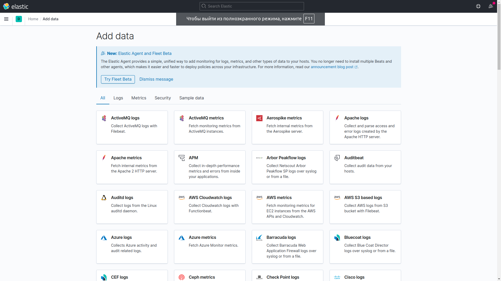

# Домашнее задание к занятию 15 «Система сбора логов Elastic Stack»

## Дополнительные ссылки

При выполнении задания используйте дополнительные ресурсы:

- [поднимаем elk в docker](https://www.elastic.co/guide/en/elastic-stack-get-started/current/get-started-docker.html);
- [поднимаем elk в docker с filebeat и docker-логами](https://www.sarulabs.com/post/5/2019-08-12/sending-docker-logs-to-elasticsearch-and-kibana-with-filebeat.html);
- [конфигурируем logstash](https://www.elastic.co/guide/en/logstash/current/configuration.html);
- [плагины filter для logstash](https://www.elastic.co/guide/en/logstash/current/filter-plugins.html);
- [конфигурируем filebeat](https://www.elastic.co/guide/en/beats/libbeat/5.3/config-file-format.html);
- [привязываем индексы из elastic в kibana](https://www.elastic.co/guide/en/kibana/current/index-patterns.html);
- [как просматривать логи в kibana](https://www.elastic.co/guide/en/kibana/current/discover.html);
- [решение ошибки increase vm.max_map_count elasticsearch](https://stackoverflow.com/questions/42889241/how-to-increase-vm-max-map-count).

В процессе выполнения в зависимости от системы могут также возникнуть не указанные здесь проблемы.

Используйте output stdout filebeat/kibana и api elasticsearch для изучения корня проблемы и её устранения.

## Задание повышенной сложности

Не используйте директорию [help](./help) при выполнении домашнего задания.

## Задание 1

Вам необходимо поднять в докере и связать между собой:

- elasticsearch (hot и warm ноды);
- logstash;
- kibana;
- filebeat.

Logstash следует сконфигурировать для приёма по tcp json-сообщений.

Filebeat следует сконфигурировать для отправки логов docker вашей системы в logstash.

В директории [help](./help) находится манифест docker-compose и конфигурации filebeat/logstash для быстрого 
выполнения этого задания.

Результатом выполнения задания должны быть:

- скриншот `docker ps` через 5 минут после старта всех контейнеров (их должно быть 5);
- скриншот интерфейса kibana;
- docker-compose манифест (если вы не использовали директорию help);
- ваши yml-конфигурации для стека (если вы не использовали директорию help).

```
$ docker ps
CONTAINER ID   IMAGE                                                  COMMAND                  CREATED          STATUS          PORTS                                        NAMES
6eb47e7206e3   docker.elastic.co/elasticsearch/elasticsearch:7.11.0   "/bin/tini -- /usr/l…"   12 minutes ago   Up 12 minutes   0.0.0.0:9200->9200/tcp, 9300/tcp             es-hot
7360d9455952   docker.elastic.co/elasticsearch/elasticsearch:7.11.0   "/bin/tini -- /usr/l…"   12 minutes ago   Up 12 minutes   9200/tcp, 9300/tcp                           es-warm
e558398b47e9   docker.elastic.co/kibana/kibana:7.11.0                 "/bin/tini -- /usr/l…"   13 minutes ago   Up 13 minutes   0.0.0.0:5601->5601/tcp                       kibana
165076c979f3   python:3.9-alpine                                      "python3 /opt/run.py"    13 minutes ago   Up 13 minutes                                                some_app
f8d3adfae2f5   docker.elastic.co/logstash/logstash:6.3.2              "/usr/local/bin/dock…"   13 minutes ago   Up 13 minutes   5044/tcp, 9600/tcp, 0.0.0.0:5046->5046/tcp   logstash
```



Также добавил ```command: "chmod go-w /usr/share/filebeat/filebeat.yml"```, иначе не работало из-за доступов, и 
на рабочей машине сделал ```sudo sysctl -w vm.max_map_count=262144```, т.к. всеми возможными способами в контейнерах невозможно было поменять.

## Задание 2

Перейдите в меню [создания index-patterns  в kibana](http://localhost:5601/app/management/kibana/indexPatterns/create) и создайте несколько index-patterns из имеющихся.

Перейдите в меню просмотра логов в kibana (Discover) и самостоятельно изучите, как отображаются логи и как производить поиск по логам.

В манифесте директории help также приведенно dummy-приложение, которое генерирует рандомные события в stdout-контейнера.
Эти логи должны порождать индекс logstash-* в elasticsearch. Если этого индекса нет — воспользуйтесь советами и источниками из раздела «Дополнительные ссылки» этого задания.

```
Приложение передает логи строкой, а не json...так обычно не делают, а требуют от разрабочиков формата json с удобными для них ключами,
т.к. они буду фильтрацию/поиск и производить по этим ключам.

Перечитал статьи, перепробовал разные настройки, логи не отправляются...нужны советы
Как проверять работу отдельно например filebeat, что он впитал и что выдал?
Как проверять работу отдельно logstash и т.п. Т.е. как это можно тестировать ручками, и видеть результаты...
а то проблема может быть вовсе не в настройках...перебирая разные их варианты можно придти в тупик и много времени потратить.
Разве сервис filebeat не должен работать фоново, чтобы отправлять логи? У меня он отрабатывает раз и завершается успешно. Кто тогда логи отправлять будет?
```