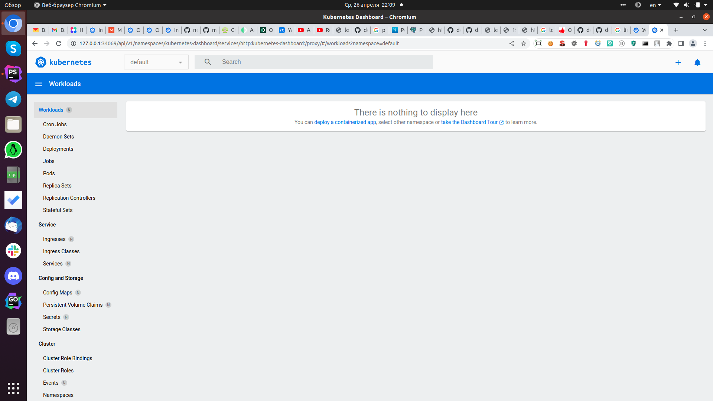

# Домашнее задание к занятию «Kubernetes. Причины появления. Команда kubectl»

### Цель задания

Для экспериментов и валидации ваших решений вам нужно подготовить тестовую среду для работы с Kubernetes. Оптимальное решение — развернуть на рабочей машине или на отдельной виртуальной машине MicroK8S.

------

### Чеклист готовности к домашнему заданию

1. Личный компьютер с ОС Linux или MacOS 

или

2. ВМ c ОС Linux в облаке либо ВМ на локальной машине для установки MicroK8S  

------

### Инструкция к заданию

1. Установка MicroK8S:
    - sudo apt update,
    - sudo apt install snapd,
    - sudo snap install microk8s --classic,
    - добавить локального пользователя в группу `sudo usermod -a -G microk8s $USER`,
    - изменить права на папку с конфигурацией `sudo chown -f -R $USER ~/.kube`.

2. Полезные команды:
    - проверить статус `microk8s status --wait-ready`;
    - подключиться к microK8s и получить информацию можно через команду `microk8s command`, например, `microk8s kubectl get nodes`;
    - включить addon можно через команду `microk8s enable`; 
    - список addon `microk8s status`;
    - вывод конфигурации `microk8s config`;
    - проброс порта для подключения локально `microk8s kubectl port-forward -n kube-system service/kubernetes-dashboard 10443:443`.

3. Настройка внешнего подключения:
    - отредактировать файл /var/snap/microk8s/current/certs/csr.conf.template
    ```shell
    # [ alt_names ]
    # Add
    # IP.4 = 123.45.67.89
    ```
    - обновить сертификаты `sudo microk8s refresh-certs --cert front-proxy-client.crt`.

4. Установка kubectl:
    - curl -LO https://storage.googleapis.com/kubernetes-release/release/`curl -s https://storage.googleapis.com/kubernetes-release/release/stable.txt`/bin/linux/amd64/kubectl;
    - chmod +x ./kubectl;
    - sudo mv ./kubectl /usr/local/bin/kubectl;
    - настройка автодополнения в текущую сессию `bash source <(kubectl completion bash)`;
    - добавление автодополнения в командную оболочку bash `echo "source <(kubectl completion bash)" >> ~/.bashrc`.

------

### Инструменты и дополнительные материалы, которые пригодятся для выполнения задания

1. [Инструкция](https://microk8s.io/docs/getting-started) по установке MicroK8S.
2. [Инструкция](https://kubernetes.io/ru/docs/reference/kubectl/cheatsheet/#bash) по установке автодополнения **kubectl**.
3. [Шпаргалка](https://kubernetes.io/ru/docs/reference/kubectl/cheatsheet/) по **kubectl**.

------

### Задание 1. Установка MicroK8S

1. Установить MicroK8S на локальную машину или на удалённую виртуальную машину.
```
$ microk8s version
MicroK8s v1.26.3 revision 4959
```
2. Установить dashboard.
```
$ microk8s enable dashboard
....

$ microk8s status -a dashboard
enabled
```
3. Сгенерировать сертификат для подключения к внешнему ip-адресу.
```
$ sudo microk8s refresh-certs --cert front-proxy-client.crt
[sudo] пароль для somov: 
Taking a backup of the current certificates under /var/snap/microk8s/4959/certs-backup/
Creating new certificates
Signature ok
subject=CN = front-proxy-client
Getting CA Private Key
Restarting service kubelite.
```
Далее ошибка о том, что сертификат устарел x509...хотя сертификаты перегенерировал множество раз, так побороть её и не смог.
Проверял сертификаты, действуют еще 365 дней, а ошибка так и осталась.
Решил попробовать альтернативное ПО установить, и проверить будут ли там такие ошибки, взял minikube на вооружение.
И о чудо! Всё настраивается автоматом, и нет никаких проблем!

Версия
```
$ minikube version
minikube version: v1.30.1
commit: 08896fd1dc362c097c925146c4a0d0dac715ace0
```

Включение dashboard
```
minikube dashboard
🔌  Enabling dashboard ...
```

------

### Задание 2. Установка и настройка локального kubectl
1. Установить на локальную машину kubectl.
```
kubectl version --output=json
{
  "clientVersion": {
    "major": "1",
    "minor": "27",
    "gitVersion": "v1.27.1",
    "gitCommit": "4c9411232e10168d7b050c49a1b59f6df9d7ea4b",
    "gitTreeState": "clean",
    "buildDate": "2023-04-14T13:21:19Z",
    "goVersion": "go1.20.3",
    "compiler": "gc",
    "platform": "linux/amd64"
  },
  "kustomizeVersion": "v5.0.1"
}
```
2. Настроить локально подключение к кластеру.
В minikube автоматом настраивается
3. Подключиться к дашборду с помощью port-forward.
Ошибки сертификатов с устарением....
```
microk8s kubectl port-forward -n kube-system service/kubernetes-dashboard 10443:443
microk8s kubectl port-forward -n kube-system service/kubernetes-dashboard 8080:443
```

А вот minikube сразу пробрасывает порты, можно зайти извне, ссылка вот такая
```
http://127.0.0.1:34069/api/v1/namespaces/kubernetes-dashboard/services/http:kubernetes-dashboard:/proxy/#/workloads?namespace=default
```

------

### Правила приёма работы

1. Домашняя работа оформляется в своём Git-репозитории в файле README.md. Выполненное домашнее задание пришлите ссылкой на .md-файл в вашем репозитории.
2. Файл README.md должен содержать скриншоты вывода команд `kubectl get nodes` и скриншот дашборда.

### Решение
Dashboard: 

```
$ kubectl get nodes
NAME       STATUS   ROLES           AGE   VERSION
minikube   Ready    control-plane   18m   v1.26.3
```

------

### Критерии оценки
Зачёт — выполнены все задания, ответы даны в развернутой форме, приложены соответствующие скриншоты и файлы проекта, в выполненных заданиях нет противоречий и нарушения логики.

На доработку — задание выполнено частично или не выполнено, в логике выполнения заданий есть противоречия, существенные недостатки.
